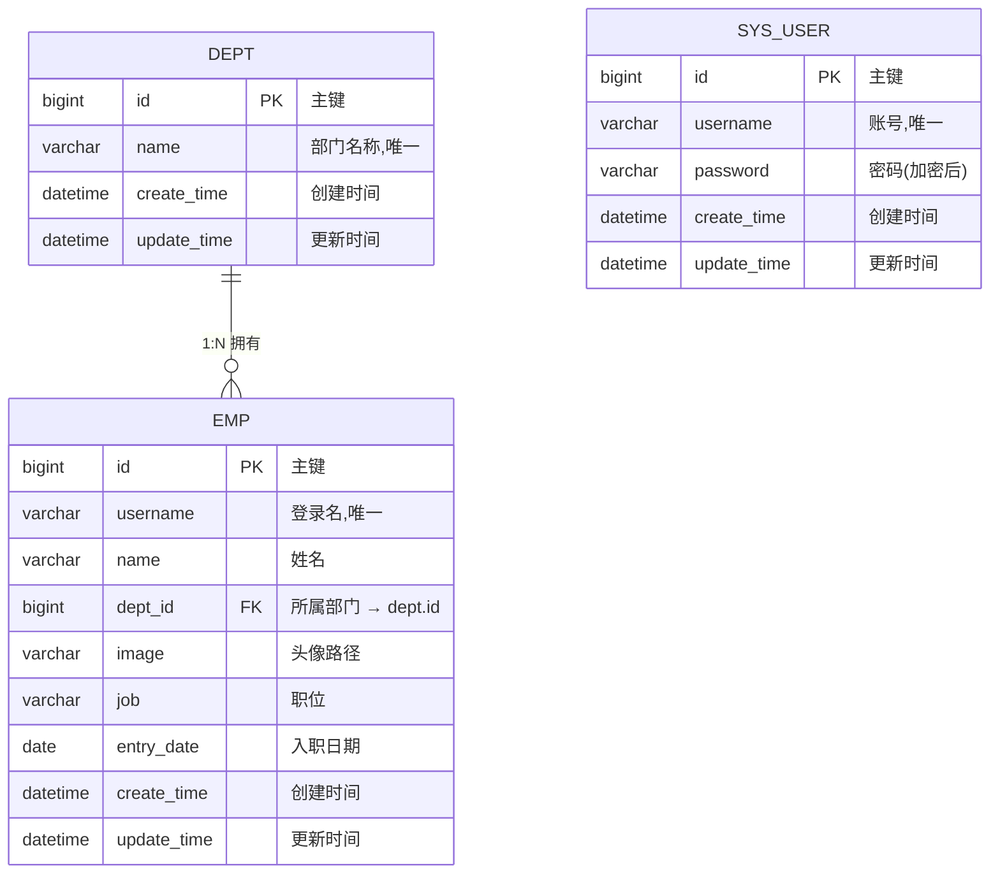

# 数据库设计文档 · 员工信息管理系统

> 数据库：`employee_system`　引擎：InnoDB　字符集：utf8mb4
> 建表脚本：`sql/schema.sql`　测试数据：`sql/data.sql`

---

## 1. 设计要点（先想清楚再画）

- **部门 : 员工 = 1 : N**（一个部门有多个员工，一个员工只属于一个部门）
- **`sys_user` 现在独立**（只存账号密码），以后可扩展 `emp.user_id` 把员工和账号关联
- **有员工的部门不许删** → 外键 `ON DELETE RESTRICT`（防误删）
- **公共字段交给数据库维护**：`create_time` 默认当前时间，`update_time` 更新时自动刷新

---

## 2. ER 图

---

## 3. 表结构

### 3.1 `dept` 部门表

| 字段 | 类型 | 约束 | 说明 |
|---|---|---|---|
| id | BIGINT | PK, AUTO_INCREMENT | 主键ID |
| name | VARCHAR(50) | NOT NULL, UNIQUE(`uk_dept_name`) | 部门名称（唯一） |
| create_time | DATETIME | NOT NULL, DEFAULT CURRENT_TIMESTAMP | 创建时间 |
| update_time | DATETIME | NOT NULL, DEFAULT CURRENT_TIMESTAMP ON UPDATE CURRENT_TIMESTAMP | 更新时间 |

### 3.2 `emp` 员工表

| 字段 | 类型 | 约束 | 说明 |
|---|---|---|---|
| id | BIGINT | PK, AUTO_INCREMENT | 主键ID |
| username | VARCHAR(20) | NOT NULL, UNIQUE(`uk_emp_username`) | 登录名 |
| name | VARCHAR(20) | NOT NULL | 姓名 |
| dept_id | BIGINT | FK → `dept.id`, 可空 | 所属部门 |
| image | VARCHAR(200) | 可空 | 头像路径 |
| job | VARCHAR(20) | 可空 | 职位 |
| entry_date | DATE | 可空 | 入职日期 |
| create_time | DATETIME | NOT NULL, DEFAULT CURRENT_TIMESTAMP | 创建时间 |
| update_time | DATETIME | NOT NULL, DEFAULT CURRENT_TIMESTAMP ON UPDATE CURRENT_TIMESTAMP | 更新时间 |

### 3.3 `sys_user` 用户表

| 字段 | 类型 | 约束 | 说明 |
|---|---|---|---|
| id | BIGINT | PK, AUTO_INCREMENT | 主键ID |
| username | VARCHAR(20) | NOT NULL, UNIQUE(`uk_user_username`) | 账号 |
| password | VARCHAR(100) | NOT NULL | 密码（加密后存储） |
| create_time | DATETIME | NOT NULL, DEFAULT CURRENT_TIMESTAMP | 创建时间 |
| update_time | DATETIME | NOT NULL, DEFAULT CURRENT_TIMESTAMP ON UPDATE CURRENT_TIMESTAMP | 更新时间 |

---

## 4. 索引与外键清单

| 名称 | 类型 | 字段 | 作用 |
|---|---|---|---|
| PRIMARY | 主键索引 | id | 每张表都有，聚簇索引 |
| `uk_dept_name` | UNIQUE | dept.name | 部门名不能重复 |
| `uk_emp_username` | UNIQUE | emp.username | 登录名不能重复 |
| `uk_user_username` | UNIQUE | sys_user.username | 账号不能重复 |
| `idx_dept_id` | NORMAL | emp.dept_id | 外键字段加索引，加快关联查询 |
| `fk_emp_dept` | FOREIGN KEY | emp.dept_id → dept.id | `ON DELETE RESTRICT` / `ON UPDATE CASCADE` |

---

## 5. 关键设计决策（面试可讲）

1. **为什么删除策略用 RESTRICT？**
   部门下有员工时不允许删除，避免产生"孤儿员工"（数据不一致）。其他可选：CASCADE（级联删员工，业务上太危险）、SET NULL（员工变无部门，语义模糊）。
2. **为什么用 `COUNT(e.id)` 而不是 `COUNT(*)`？**
   LEFT JOIN 时没有员工的部门会产生一行 `e.* = NULL`，`COUNT(*)` 会数成 1，`COUNT(e.id)` 忽略 NULL 得到正确的 0。
3. **为什么 `sys_user` 先独立？**
   先把主线跑通；后续可加 `emp.user_id` 建立"一个员工一个账号"的关系，避免早期设计过度。
4. **为什么时间字段交给数据库维护？**
   避免每个插入/更新点手写时间，减少遗漏；`update_time` 用 `ON UPDATE CURRENT_TIMESTAMP` 自动刷新。
5. **为什么 `emp.dept_id` 可空？**
   允许"暂未分配部门"的员工存在（测试数据里的实习生"沈六"就是这种情况），也方便练习 `LEFT JOIN` / `IS NULL`。

---

## 6. 验证记录（实测，2026-09-13）

| 验证项 | 语句 | 结果 |
|---|---|---|
| 外键防误删 | `DELETE FROM dept WHERE id = 1;` | ✅ 报 `1451 Cannot delete or update a parent row`，RESTRICT 生效 |
| 部门员工数统计 | `SELECT d.name, COUNT(e.id) FROM dept d LEFT JOIN emp e ON d.id = e.dept_id GROUP BY d.id, d.name;` | ✅ 技术部 6 / 人事部 4 / 市场部 4 |
| 无部门员工 | `SELECT * FROM emp WHERE dept_id IS NULL;` | ✅ 仅"沈六"一条 |
| 数据量 | `SELECT COUNT(*) FROM dept / emp / sys_user;` | ✅ 3 / 15 / 2 |
